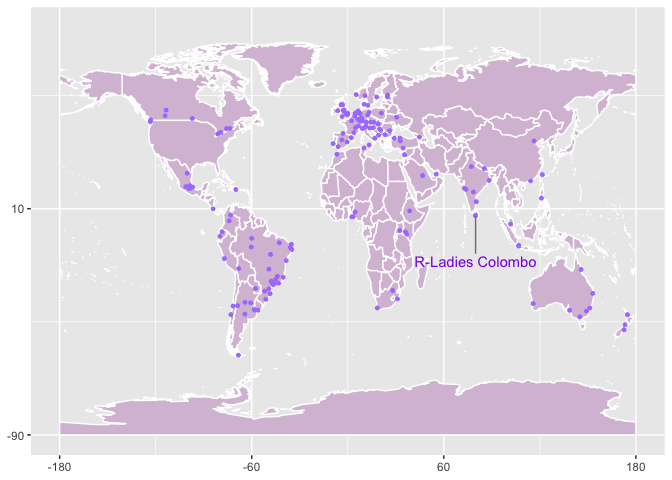

``` r
library(ggplot2)
library(maptools)
```

    ## Loading required package: sp

    ## Checking rgeos availability: TRUE

``` r
library(tibble)
library(tidyverse)
```

    ## ── Attaching packages ── tidyverse 1.2.1 ──

    ## ✓ tidyr   1.0.0     ✓ dplyr   0.8.3
    ## ✓ readr   1.3.1     ✓ stringr 1.4.0
    ## ✓ purrr   0.3.3     ✓ forcats 0.4.0

    ## ── Conflicts ───── tidyverse_conflicts() ──
    ## x dplyr::filter() masks stats::filter()
    ## x dplyr::lag()    masks stats::lag()

``` r
library(ggrepel)
data(wrld_simpl)

p <- ggplot() +
  geom_polygon(
    data = wrld_simpl,
    aes(x = long, y = lat, group = group), fill = "thistle", colour = "white"
  ) +
  coord_cartesian(xlim = c(-180, 180), ylim = c(-90, 90)) +
  scale_x_continuous(breaks = seq(-180, 180, 120)) +
  scale_y_continuous(breaks = seq(-90, 90, 100))
```

    ## Regions defined for each Polygons

``` r
# R-Ladies current chapters: https://github.com/rladies/starter-kit/blob/master/Current-Chapters.csv
df <- read.csv(here::here("Current-Chapters.csv"), header = TRUE) %>% as_tibble()
df$City <- as.character(df$City)
df$Country <- as.character(df$Country)
## location details of the cities : https://simplemaps.com/data/world-cities
location_df <- read.csv(here::here("worldcities.csv"), header = TRUE) %>% as_tibble()
location_df$city <- as.character(location_df$city)
location_df$country <- as.character(location_df$country)

## location details of US cities: https://simplemaps.com/data/us-cities
location_us <- read.csv(here::here("uscities.csv"), header = TRUE) %>% as_tibble()
location_us$city <- as.character(location_us$city)
location_us$country <- "USA"

d <- left_join(df, location_df, by = c("Country" = "country", "City" = "city")) %>%
  select(c("Country", "City", "Status", "lat", "lng"))

d_USA <- d %>%
  filter(Country == "USA") %>%
  select("Country", "City", "Status") %>%
  left_join(y = location_us, by = c("City" = "city")) %>%
  select(c("Country", "City", "Status", "lat", "lng")) %>%
  distinct(City, .keep_all = TRUE)

d_full <- bind_rows((d %>% filter(Country != "USA")), d_USA) %>%
  filter(Status != "Retired on 29-09-2019") %>%
  distinct(Country, City, .keep_all = TRUE)


dsl <- d_full %>% filter(Country == "Sri Lanka")


p <- p +
  geom_point(
    data = d_full, aes(x = lng, y = lat), color = "mediumpurple1", size
    = 1
  ) +
  geom_point(
    data = dsl, aes(x = lng, y = lat), color = "mediumpurple1", size
    = 1
  ) +
  geom_text_repel(
    data = dsl, aes(label = "R-Ladies Colombo", x = lng, y = lat),
    box.padding = 0.35,
    point.padding = 0.1,
    segment.color = "grey50",
    nudge_y = -20,
    color = "blueviolet"
  ) +
  theme(axis.title = element_blank())
p
```

    ## Warning: Removed 46 rows containing missing values (geom_point).



``` r
ggsave(here::here("R-ladiesmap.png"), width = 15, height = 7)
```

    ## Warning: Removed 46 rows containing missing values (geom_point).
